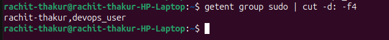

# Linux Users, Groups and Permissions

A beginner-friendly guide to understanding Linux users, groups, and file permissions, including /etc/passwd and /etc/group.

# What You'll Learn

- What Linux users are

- What Linux groups are

- Understanding /etc/passwd

- Understanding /etc/group

- Reading file permissions

- Understanding r, w, and x

- Using chmod

- Using chown


#  1. Linux Users

A user is an account that can use a Linux system, and it is able to login and run processes.
Examples:

- rahul
- ram
- root

Linix doesn't track names, thats why it assigns a unique UID (User ID).

Check the current user:

```whoami```


Check user information:

```id```

##  2. /etc/passwd

This is the file that contains basic information about users.

command to view user info:

```cat /etc/passwd```


A line may look like:

`rachit:x:1001:1001:rachit:/home/alice:/bin/bash`


The fields are separated by :.


| Field | Meaning |
| :--- | :--- |
| `rachit` | Username |
| `x` | Password placeholder |
| `1001` | UID (User ID) |
| `1001` | GID (Group ID) |
| `rachit` | User description |
| `/home/alice` | Home directory |
| `/bin/bash` | Default shell |


## TYPES OF USERS

- **Root (Superuser):** Full system control. Can install software, change config files and delete anything. Powerful but risky.
- **Regular User:** Limited access. Can create files, run applications, but not modify system-level settings.
- **Sudo User:** Regular user with temporary admin rights via the sudo command. Common in modern systems.
- **System/Service Account:** Non-human accounts used by services (e.g., mysql, nginx). Limited privileges.
- **Guest User:** Temporary users with minimal privileges. Changes are not saved after logout. (desktop     environment specific)

#  3. Linux Groups

A group is a collection of users. If you give permission to a group, all users in that group get the same access. This makes it easier to manage file and system permissions for many users at once.

For example:

- developers
- ├── rahul
- ├── ram
- └── naresh

Groups make permission management easier.

Instead of giving permissions to every user individually, you can give permissions to a group.

##  4. /etc/group

The file contains information about Linux groups.

command to list groups:

```cat /etc/group```

Example:

developers:x:1002:alice,bob

The meaning are:


| Field | Meaning |
| :--- | :--- |
| `developers` | Group name |
| `x` | Password placeholder |
| `1002` | GID (Group ID) |
| `alice,bob` | Group members |


#  5. Linux File Permissions

File permissions are core to the security model used by Linux systems. They determine who can access files and directories on a system and how. 

Linux uses three basic permissions:


| Permission | Symbol | Meaning |
| :--- | :--- | :--- |
| Read | r | Read/view |
| Write | w | Modify |
| Execute | x | Execute/access |


Permissions are assigned to three categories:

| User | Group | Others |
| :--- | :--- | :--- |
|↓     |   ↓   |      ↓ |
|rwx   |    rw-|     r--|

This will look like this in system: `drwxr-xr-x`

- **d:** `d` is directory(file type).
- **rwx:** User can read, write and execute.
- **rw-:** Groups can only read and write.
- **r--:** Others can only read.


##  6. Check File Permissions

Use:

```ls -l```


Example:

`drwxrwxr-x  9 rachit-thakur rachit-thakur     4096 Oct  1 11:38  90DaysOfDevOp`

Here:

- Owner → rachit-thakur
- Group → rachit-thakur
- Permissions → drwxrwxr-x


##  8. Changing Permissions with chmod

Chmod is used to change file permissions.
- **+:** for add permissions.
- **-:** for removeing permissions.

Add execute permission for the owner
- ```chmod u+x <file name>```

Add write permission for the group
- ```chmod g+w <file name>```

Remove read permission from others
- ```chmod o-r <file name>```

The letters mean:

- u → user/owner
- g → group
- o → others
- a → all

##  9. Numeric Permissions

Linux also allows permissions to be represented using numbers.

- Read    = 4
- Write   = 2
- Execute = 1


For example:

- 7 = 4 + 2 + 1 = rwx
- 6 = 4 + 2     = rw-
- 5 = 4 + 1     = r-x
- 4 = 4         = r--

Example
```chmod 755 <filename>```

Means:

755

- 7 → Owner  → rwx
- 5 → Group  → r-x
- 5 → Others → r-x


## 10. Changing Ownership with chown

chown changes the owner of a file.

Example:

```sudo chown new_owner filename.txt```


Change both owner and group:

```sudo chown new_owner:new_group filename.txt```

Check the result:

```ls -l filename.txt```

---

# **Task1️⃣ User & Group Management**

Create a user `devops_user` and add them to a group `devops_team`.

- create a user:
```sudo useradd devops_user```\
<br>


- create a group:
```sudo groupadd devops_team```

- add user to the group:
```sudo usermod -aG devops_team devops_user```\
<br>


Set a password and grant **sudo** access.

- set a password for the user:
```sudo passwd devops_user```\
<br>


- grant sudo access to the devops user:
```sudo usermod -aG sudo devops_user```

- verify the sudo access:
```getent group sudo | cut -d: -f4```\
<br>


Restrict SSH login for certain users in `/etc/ssh/sshd_config`.

- restrict SSH login for certain user:
```sudo vim /etc/ssh/sshd_config```

- write in file:
`DenyUsers devops_user`

---


